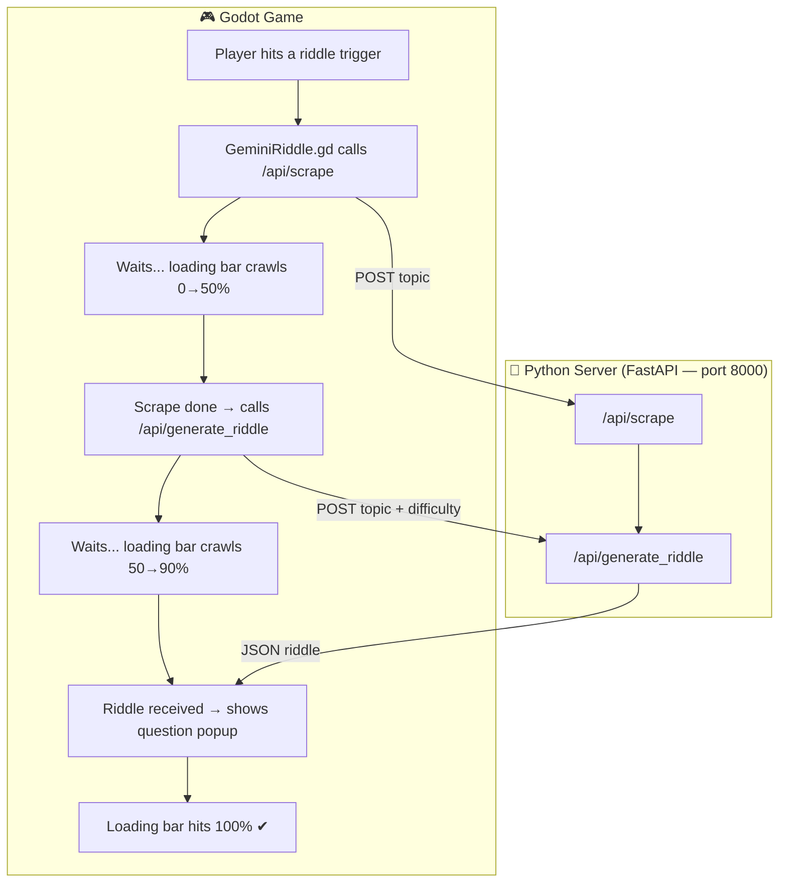
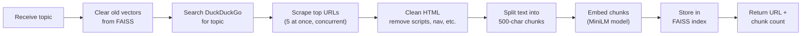
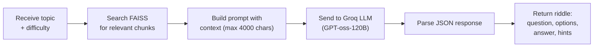
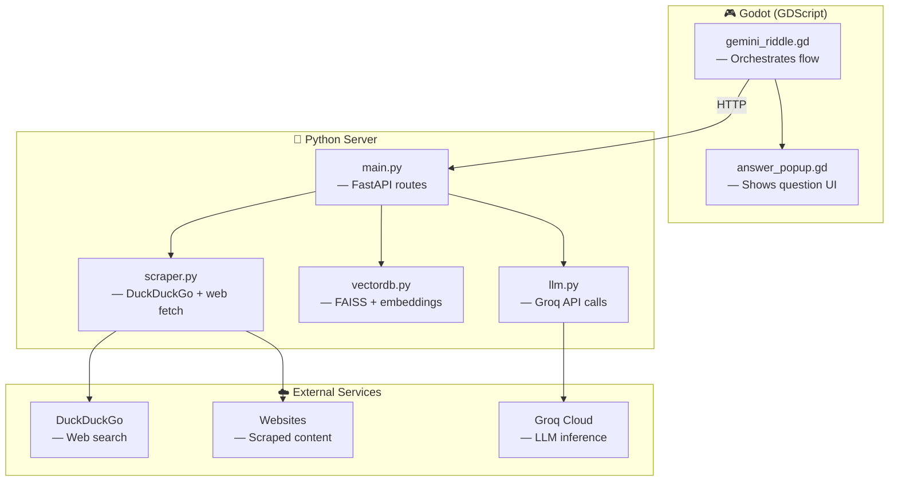

# Endless Worlds — System Architecture

> How the game generates questions from the web in real-time.

## Overall Flow



## Scrape Pipeline — `/api/scrape`



## Riddle Generation — `/api/generate_riddle`



## Component Map



## File Structure

```
python_server/
├── main.py              ← API routes: /api/scrape, /api/rag, /api/generate_riddle
├── requirements.txt     ← Python dependencies
├── start_server.bat     ← Quick-start script
├── models/
│   └── schemas.py       ← Request/response models
└── services/
    ├── scraper.py       ← DuckDuckGo search + concurrent web scraping
    ├── vectordb.py      ← FAISS vector store + MiniLM embeddings
    └── llm.py           ← Groq LLM calls + context trimming
```

## How It All Connects (Simple Version)

```
Player walks into trigger
        ↓
  "What topic?" → "origami"
        ↓
  Search the web for "origami"
        ↓
  Scrape a webpage about origami
        ↓
  Chop the text into small pieces
        ↓
  Store pieces as vectors (numbers)
        ↓
  Find the most relevant pieces
        ↓
  Ask the AI to write a question
        ↓
  Show the question to the player
        ↓
  Player answers → score updates 🎉
```
